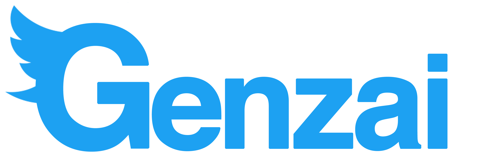

# Inspiration
Genzai is a Japanese word for current. The reason why we chose to pursue this project is that we believe there is much to learn from the so-called social world. Today more than ever social media governs the way we live our lives there are about 6,000 tweets a second, billions of tweets are posted every year. All that data, all that information, if we could visualize the highlights and make them easier to understand we could provide insights to business, marketing teams, and social spaces.

# What it does
Simply stated Genzai is a dashboard. The centerpiece of our work is a map of the United States. By clicking on a state users can instantaneously receive insights on the tweet-centric cities within that region. For example, by clicking on the state of Kentucky a user can understand the trending hashtags in the city of Louisville. They can also receive data on how to access the feed for that given hashtag.

# How we built it
We built Genzai's back-end with python and used the flask framework to transfer data back in forth from the front end and back end of the code. Python is the language we directly linked in with the Twitter API. Most of our front end is built with javascript and HTML. To communicate back in forth with our map inputs and our data calls we used jQuery and AJAX. Most of the languages and techniques that we used were new to our team members so there was much learning. We used an iterative model for our software process so we tried to set goals and build prototypes as soon as possible so we could continue to make revisions and improve up our functional and non-functional requirements.

# Challenges we ran into
Ultimately integrating the flask framework was difficult the documentation was scanty. It wasn't always clear what we needed to do to bridge the work done by our front end and back end team. We really took advantage of the mentors, they were such a help in understanding how to correct some the syntactical and runtime errors. We ultimately overcame most of our challenges.

# Accomplishments that we're proud of
We are happy that the core goals that we set from the beginning were accomplished. We also felt like we gained courage from this experience. It was do or die to get some of the twitter, python, flask, and javascript tools we were using to work. Some of the feats that we would have normally been discouraged from trying we overcame for the sake of the goal.

# What we learned
We learned how to use Javascript. We also learned about different frameworks and how they work with the code itself. We like executing the python script using the AJAX javascript. We interacted with the command line more than ever before. Even those of us who were more familiar with the cmd found that they were more comfortable understanding the error messages and responses from the server.

# What's next for Genzai
#innovation
